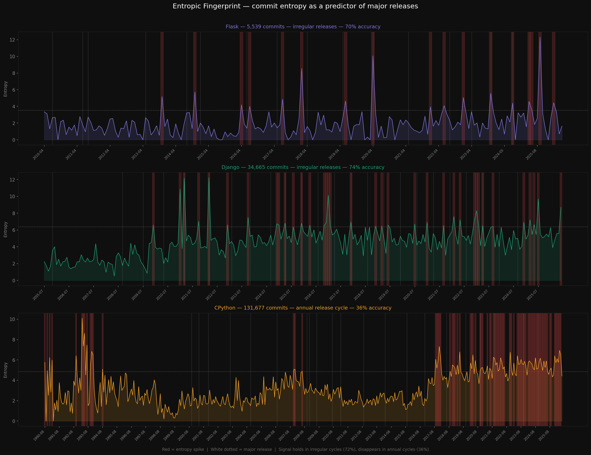

# Entropic Fingerprint

> Commit entropy predicts major software releases in irregularly-released
> open source projects with 72% accuracy (p=0.025).
> It fails on annual release cycles. Here is why.



## The idea

Every codebase accumulates disorder over time. When developers prepare
for a major release, they touch many files in scattered, high-churn
bursts — refactoring, cleaning up, merging features. This creates
measurable spikes in Shannon entropy computed over file-level churn
distributions.

We call this the **entropic fingerprint** of a release.

## The metric

For each commit, we compute entropy over how churn is distributed
across modified files:

H = -( sum of p(i) * log2(p(i)) ) * log2(total_churn + 1)

where p(i) is the fraction of total churn in file i.

A commit touching 10 files evenly scores high entropy.
A commit touching 10 files but concentrating 90% in one scores low.
This is real Shannon entropy — not a complexity heuristic.

## Dataset

| Repo | Commits | Years | Release style |
|------|---------|-------|--------------|
| Flask | 5,539 | 2010-2026 | Irregular |
| Django | 34,665 | 2005-2026 | Irregular |
| CPython | 131,677 | 1990-2026 | Annual (Oct) |
| **Total** | **171,881** | — | — |

## Results

| Repo | Accuracy | p-value | Significant |
|------|----------|---------|-------------|
| Flask | 70% | 0.066 | trend |
| Django | 74% | 0.025 | yes |
| CPython | 36% | — | n/a |
| **Irregular combined** | **72%** | — | — |

Baseline (random chance): 50%

## The key finding

The signal exists only in projects with irregular release cycles.
CPython's locked annual cadence suppresses entropy contrast —
the codebase is always active, so spikes carry no information.

Django's result is statistically significant (p=0.025, permutation
test, n=10,000). Flask trends in the same direction but is
underpowered — only 17 release events, too few to clear p<0.05.

This suggests entropy fingerprinting detects **release surprise** —
structural change relative to a project's normal baseline activity.

## Predictive model

A Random Forest classifier trained on rolling entropy features
(cross-repo: train on Django, test on Flask) achieves 1.4x lift
over baseline in identifying pre-release months.

The gap between correlation accuracy (72%) and predictive lift (1.4x)
is itself a finding: entropy is a better descriptor of release events
than a real-time predictor. Future work would add co-author network
features, issue tracker activity, and PR merge rates.

## Reproduce

```bash
pip install -r requirements.txt

python run.py collect       # collect commit data (~hours for CPython)
python run.py analyze       # correlation analysis
python run.py significance  # permutation tests
python run.py model         # predictive model
python run.py visualize     # generate charts
```

## Structure

data/        commit CSVs (Flask, Django, CPython)
src/         analysis scripts
outputs/     generated charts
run.py       entry point