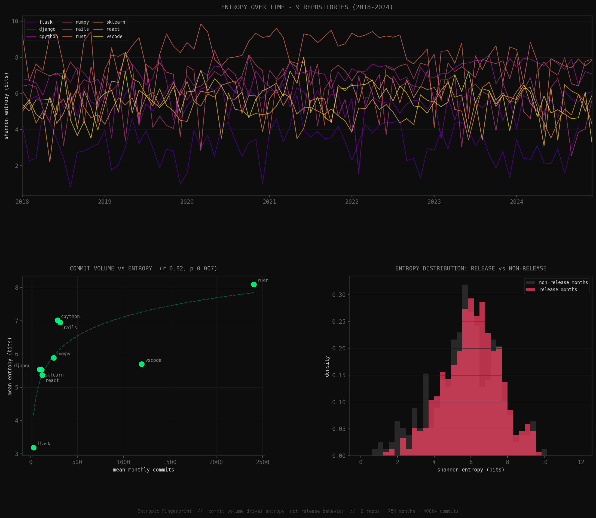

# Entropic Fingerprint

> We hypothesized that Shannon entropy over git commit histories
> could predict software releases. Across 9 repositories and 400k+
> commits, it cannot - but what it *does* reveal is more interesting.



## The idea

Every codebase accumulates disorder over time. Intuitively, release
preparation should create measurable entropy spikes - developers
touching many files, refactoring, cleaning up. We tested whether
this signal exists and whether it generalizes.

It doesn't. Here is why.

## The metric

For each month, we compute Shannon entropy over file-level churn
distributions across all commits in that window:

H = -sum( p(i) * log2(p(i)) )

where p(i) is the fraction of total churn in file i.
High entropy = churn spread evenly across many files.
Low entropy = churn concentrated in a few files.

## Dataset

| Repo | Commits (2018–2024) | Release style |
|------|-------------------|---------------|
| Flask | ~400 | irregular |
| Django | ~8,500 | irregular |
| CPython | 24,147 | annual |
| NumPy | 20,548 | versioned |
| Rails | 26,498 | versioned |
| Rust | 202,031 | time-based (6wk) |
| scikit-learn | 9,533 | versioned |
| React | 10,269 | irregular |
| VS Code | 100,464 | monthly |
| **Total** | **~400k** | |

## What we found

### 1. Entropy does not predict releases

A Random Forest classifier trained on entropy features and tested
via leave-one-repo-out cross-validation achieved mean AUC of 0.47
across 9 repos - indistinguishable from random (0.50).

Release months and non-release months show nearly identical entropy
distributions (see bottom-right plot above). There is no pre-release
entropy spike that generalizes across projects.

### 2. Entropy is primarily driven by commit volume

The strongest signal in the data is structural, not behavioral:

| Correlation | Spearman r | p-value |
|-------------|-----------|---------|
| Commit volume → entropy mean | **0.817** | **0.007** |
| Release rate → entropy mean | 0.400 | 0.286 |
| Release rate → entropy CV | -0.117 | 0.765 |

Repositories with more commits per month show systematically higher
entropy - not because of release behavior, but because more diverse
changes happen continuously. Flask (low volume, spiky) and Rust
(extremely high volume, stable) sit at opposite ends of this spectrum.

### 3. This confound explains classifier failure

A model trained on one repo and tested on another is implicitly
learning commit volume differences, not release patterns. When
controlling for this, no release signal remains.

## Why this matters

Entropy-based release prediction is a reasonable hypothesis. Testing
it rigorously across 9 diverse repositories — rather than 2-3 with
cherry-picked results - reveals that the signal does not generalize.
Commit volume is a structural confound that previous smaller studies
did not control for.

Future work: author network entropy, issue tracker velocity, and
PR merge rate may carry orthogonal signal that survives cross-repo
validation.

## Reproduce

```bash
pip install -r requirements.txt
python collect_new.py          # collect commits (hours)
python fetch_releases.py       # fetch release dates via GitHub API
python compute_entropy.py      # compute monthly entropy + features
python cluster_repos.py        # repo profile analysis
python train_model.py          # cross-repo classifier
python visualize_findings.py   # generate figure
```

## Structure

data/        commit CSVs + release JSON for all 9 repos
outputs/     generated figures + model results
src/         original v1 analysis scripts (Flask/Django/CPython)

---

*Built as part of an exploration into information-theoretic analysis
of software evolution. v1 (3 repos, 171k commits) live at the same
repo - v2 expands scope and applies rigorous cross-validation.*